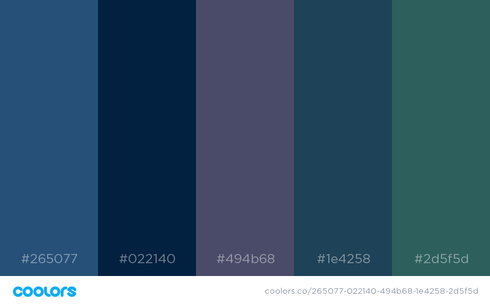

<div align="center">
    <h1>  Residence Giulio Cesare  </h1>
</div>

<div align="center">
    <a href="https://milestone1-pierluca.herokuapp.com/index.html"> View Website in Heroku </a>
</div>


## Table of Contents
1. [UX](#ux)
    - [Ideal Client](#The-ideal-client-for-this-business-is)
    - [Visitors' Searches](#Visitors-to-this-website-are-searching-for)
    - [Project's Purpose](#This-project-is-the-best-way-to-help-them-achieve-these-things-because)
    - [Client Stories](#client-stories)
    - [Wireframes](#wireframes)

2. [Features](#features)
    - [Existing Features](#existing-features)
        - [Navbar](#Navbar)
        - [Landing](#Landing-Page)
        - [Location](#Location)
        - [Carousel](#Room-Carousel)
        - [Contact](#Contact-Form)
        - [Alternate Language](#Alternate-Language-Version)
        - [Colors Palette](#Color-palette)
        - [Fonts](#Fonts)

    - [Features for Future Releases](#features-for-future-releases)

3. [Technologies Used](#technologies-used)
    - [Libraries](#libraries)
    - [Tools](#tools)


4. [Testing](#testing)

5. [Deployment](#deployment)
    - [How to run this project locally](#how-to-run-this-project-locally)
    - [Heroku Deployment](#heroku-deployment)

6. [Credits](#credits)
    - [Content](#content)
    - [Images](#images)
    - [Code](#code)
    - [Acknowledgements](#acknowledgements)

8. [Contact](#contact)

My project is about a fictional Residence in Rome, in proximity with the Vatican. 
User navigating to the site will be exposed to the following information:
* Residence Location
* a view of the rooms, with Link to Instagram Account
* a form to get in contact with the residence to book their accomodation
 
# UX

This is a website of a Residence/ B&B located in the hearth of Rome, providing services to the turist, such as
accomodation, for short and long stay, passage from city's airport and guided tours.

### The ideal client for this business is:
First and foremost, potential tourists or visitors, for every period of the year, Rome is a good destination regardless
of the season, then the site is targeting in particular:

* people without means of transportation.
* high segment target, because it's located in a central and expensive neighbourhood.
* returning clients, who wants to keep contact.
* tourist that would like to enrich their experience with guided tours

### Visitors to this website are searching for:
* location of the residence.
* contact.
* pictures of the rooms.

### This project is the best way to help them achieve these things because:

People looking for an accomodation in their selected destination need to make an informed decision and they are usually
relying on a website with full visual and geo-localized content. 
The site is presenting them in a succint and easy to use way everything they need to know.

The goal was to make a strong first impact with the landing page, and therefore serve the most relevant informations.

* Picture landing page, for striking first impression.
* A Carousel with photos showing the general look and feel of the Rooms.
* A Section showing the location and address
* A Section with a contact form for enquiries and bookings.
* A navigation bar and a footer

### Client stories

As a visitor of the Residence Giulio Cesare website I expect the following:

1. To find with ease what I am looking for, I want the layout of the site to make sense so I am not confused 
or frustated using it. 

1. The information I am presented with to be laid out in a way that is easy for me to digest, so that I find what 
I need in the quickest possible way.

1. The site to be easily navigable from any device, desktop, tablet or phone. For the content to look good and be useable on all of these devices.

1. To learn more about the residence and their offering, so that I can make the best possible choice.

1. To easily locate it in the city of Rome

1. Plenty of high quality images of the Rooms that I can book.

1. To be able to get in contact to the management in a easy way.


### Wireframes

Wireframe mockup, created using [Balsamiq](https://balsamiq.com/), is available [here](wireframes/Wireframe.pdf)
 

# Features

In this section, you should go over the different parts of your project, and describe each in a sentence or so.
 
## Existing Features

### Navbar
### Landing Page
### Location
A dedicated section for location has been designed, containing an *iframe* from google maps 
and a card with the address.
### Room Carousel
A carousel sliding through three images of the residence has been framed in a dedicate section. Naviagation is possible
via indicators or via control.
### Contact Form

This page includes a form with 4 required fields:
* Name
* Phone Number
* Email Address
* Message

Control have been implemented to avoid leaving the fields empty or to submit invalid mail addresses.
Once the form has been validated, a *modal* window will appear, informing the user that the data won't be 
actually submitted.


### Alternate Language Version

via a flag button in the navbar( `Italy/UK`) is possible to switch between Italian or English Version of the site.

### Colors Palette



Shades of Blue and Grey have been used to convey a professional and stable image.

### Fonts

From Google Fonts has been used *Tangerine* font; for the rest of the Headings *Nobile* standard font has been used.

## Features for future releases
- A Section serving a series of card showing the attractions in proximity of the place.
- A Section showing entusiastic user comments.

# Technologies Used

## Libraries

other than the holy trinity of Web Development, HTML, CSS and JavaScript I took advantage of the following technologies:

- [JQuery](https://jquery.com)
    - The project uses **JQuery** to improve Scroll Up between Section and to show a *Modal* after Contact Form 
    Submission
- [Bootstrap](https://getbootstrap.com/)
    - The project relies heavily on **Bootstrap** component and predefined styles.
- [FontAwesome](https://fontawesome.com/)
    - **FontAwesome** is the source of most of the icons
- [Popper.js](https://popper.js.org/)
    - **Popper** is used for the responsive NavBar
- [Google Fonts](https://fonts.google.com/) 
    - to style the website fonts
    
## Tools

In terms of Tools I used the following tools, to develop and design:

- [PyCharm](https://www.jetbrains.com/pycharm/)
    -  My favourite IDE, used to generate a local website and edit each file
- [Balsamiq](https://balsamiq.com/)
    - WireFrame Designer, used with CodeInstitute license, definitively to best resource to wireframe.
- [Google Chrome](https://www.google.com/chrome/) and [Firefox](https://www.mozilla.org/en-US/firefox/new/)
    - Site has been tested on both popular Browser for several distinct dimensions.
    

# Testing

I used [W3C CSS Validation Service](https://jigsaw.w3.org/css-validator/) and [W3C Markup Validation Service](https://validator.w3.org/) 
to check the validity of the website code.

The work has been reviewed by a number of relatives and friend, mostly on the mobile, each of them giving suggestion.

The website has been test with multiple resizing to test the its responsiveness.
via the *inspect* chrome functionality it has been examined for the most popular mobile devices such as 
* iPhone 6/7/8
* iPad
* Galaxy S5

also following section has been tested:

1. Iframe Map: zooming in and out of the map.

1. Carousel: sliding through the rooms' pictures composing the carousel, testing indicators at the bottom
of the slides.

1. Contact form:
    1. Go to the "Contact" Section
    2. Try to submit the empty form and verify that an error message about the required fields appears
    3. Try to submit the form with an invalid email address and verify that a relevant error message appears
    4. Try to submit the form with all inputs valid and verify that the modal will appear.


Bugs: most relevant bug to tackle involved *bootstrap4 carousel* which arrows indicators
pushed navigation to the top of the section, but changing the `data-target` field solved it.
Other issues involved the JavaScript file which at some point was not adapting to new component added,
and this meant refactoring from the original version.

# Deployment

Site has been developed on PyCharm and pushed to GitHub via terminal commands.
code can be fetched locally with following command
```shell
git clone https://github.com/severian5it/Milestone1.git
```
## how to run this project locally
is possible to run it locally running a python server on the same location on index.html and then visiting 
*localhost:8000*
```python
python -m SimpleHTTPServer
```
## heroku deployment
Code can be deployed to heroku with following instructions:
```shell
heroku apps:create milestone1-pierluca
git push heroku master
```
first line will create the application, second line will push the current commit to heroku; no variable must be set, all
the dependency are managed by the file `index.php`, which is necessary.


# Credits

### Content
- The structure of the project was modeled on the examples provided by codeinstitute, in particular on 
[Haley Schafer Portfolio](https://github.com/Code-Institute-Solutions/StudentExampleProjectGradeFive)


## Media
- The photos used in the landing page was downloaded from [Unsplash](https://unsplash.com/), and credit goes to 
Christopher Czermak @czermak_photography.
- The photos used in the landing page was downloaded from [Unsplash](https://unsplash.com/), and credit goes to 
Cristina Gottardi.

## Acknowledgements

- I received inspiration for this project from my mentor, Aaron Sinnot.

# Contact
To contact me feel free to email

 `pdelbuono (at) gmail (dot) com`


